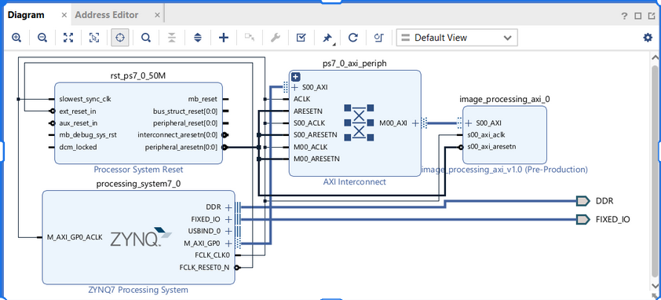
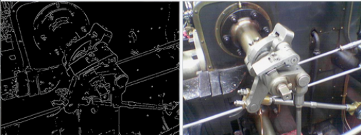
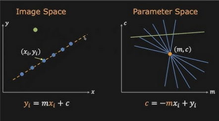
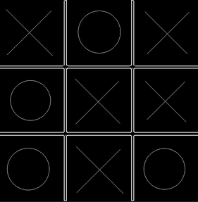
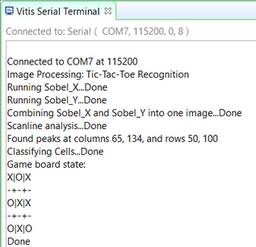

# Image Processing Tic-Tac-Toe

# Overview
- Our goal was to create an image processing pipeline that can recognize a game of tic-tac-toe. The project will make use of the Zybo board to hardware-accelerate a part of the image processing pipeline, then finish analyzing the image in software.
- Image stored in memory as an array
- AXI Writes to send image data from PS to PL
- PL - image processing module takes advantage of hardware abilities to quickly perform kernel convolution (sobel x, sobel y)
- PS finishes image processing and uses Hough transform to detect X’s vs O’s

# System Architecture

# Hardware Design (PL)

## Register Map
|Offset|Register|Description|
|------|--------|-----------|
|0x00(slv_reg0)|REG_FILTER_LO|Bits [31:0] of the kernel|
|0x04(slv_reg1)|REG_FILTER_MID|Bits [63:32] of the kernel|
|0x08(slv_reg2)|REG_FILTER_HI|Bits [71:64] of the kernel at [7:0]|
|||Scale at [15:8]|
|||Bias at [24:16]|
|0x0C(slv_reg3)|REG_IMG_WIDTH|image width|
|0x10(slv_reg4)|REG_CONTROL|pix_in at [7:0]|
|||pix_wr at [8]|
|||reset at [9]|
|0x14(slv_reg5)|REG_OUTPUT|pix_out at [7:0]|
|||pix_valid at [8]|
|||overflow at [9]|

# Software Design (PS)
## Canny Edge Detection
Image Processing technique to reduce noise and get thin, clean edges instead of thick edges
Steps:
1. Blur
2. Sobel Filter
3. Non-maxima-suppression (turn thick lines into thin lines)
4. Dual-Thresholding

## Hough Transform
- Used to detect straight lines and circles in images
- Convert pixels from coordinate space to parameter space (y = mx + b --> b = -mx + y)
- In our case, we only used it to detect X's. We assumed any non-empty space that wasn't an X was an O.

# Results

